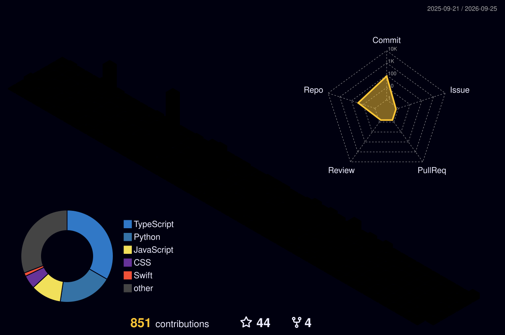

<div align="center">


<br/>


<br/>

<a href="mailto:surajkumarjha094@gmail.com"></a>
<a href="https://www.linkedin.com/in/suraj-kumar-95565a2b5/"></a>
<a href="https://github.com/surajkumarjha094"></a>
<a href="https://twitter.com/surajkumarjha094"></a>

<br/><br/>


</div>

<br/>

## About

I build systems that connect data to decisions — from training a recommendation model to shipping the interface that surfaces it. My work sits at the intersection of **machine learning and full-stack engineering**, and I care as much about a clean API as I do about model accuracy.

Currently based in India, working on an AI recommendation engine while deepening my understanding of LLMs and MLOps.

<table>
<tr>
<td width="33%" align="center">

**Focus**
<br/>
AI Recommendation Systems

</td>
<td width="33%" align="center">

**Learning**
<br/>
LLMs · MLOps · System Design

</td>
<td width="33%" align="center">

**Open to**
<br/>
Collaboration · Internships

</td>
</tr>
</table>

<br/>

## Stack

<table>
<tr>
<td valign="top" width="50%">

**Machine Learning**


</td>
<td valign="top" width="50%">

**Full Stack**


</td>
</tr>
<tr>
<td valign="top" width="50%">

**Languages**


</td>
<td valign="top" width="50%">

**Tools & Platform**


</td>
</tr>
</table>

<br/>

## Featured work

<br/>

<table>
<tr>
<td width="65%" valign="top">

### AI Recommendation Engine

Hybrid collaborative-filtering and content-based recommendation system, trained to **94.2% validation accuracy**. Serves personalized suggestions through a FastAPI backend consumed by a React frontend.

   

</td>
<td width="35%" valign="top">

**Status:** In progress (78%)
<br/>
**Repo:** [View source →](https://github.com/surajkumarjha094/REPO-NAME-1)

</td>
</tr>
<tr><td colspan="2"><hr/></td></tr>
<tr>
<td width="65%" valign="top">

### Project Two

One or two sentences describing what this project solves and the interesting engineering decision behind it.

  

</td>
<td width="35%" valign="top">

**Status:** Shipped
<br/>
**Repo:** [View source →](https://github.com/surajkumarjha094/REPO-NAME-2)

</td>
</tr>
<tr><td colspan="2"><hr/></td></tr>
<tr>
<td width="65%" valign="top">

### Project Three

One or two sentences describing what this project solves and the interesting engineering decision behind it.

  

</td>
<td width="35%" valign="top">

**Status:** In progress
<br/>
**Repo:** [View source →](https://github.com/surajkumarjha094/REPO-NAME-3)

</td>
</tr>
</table>

<br/>

## GitHub activity

<div align="center">


<br/>


<br/>


</div>

<br/>

## 3D Contribution Graph

<div align="center">



</div>

<br/>

## Contribution Snake

<div align="center">

<picture>
  <source media="(prefers-color-scheme: dark)" srcset="./dist/github-contribution-grid-snake-dark.svg">
  <source media="(prefers-color-scheme: light)" srcset="./dist/github-contribution-grid-snake.svg">
  
</picture>

</div>

<br/>

## Roadmap

```
Deep Learning fundamentals      ████████████████░░░░  80%
LLM fine-tuning & RAG           ███████████░░░░░░░░░  55%
MLOps (Docker · CI/CD)          ████████░░░░░░░░░░░░  40%
System Design                   ██████░░░░░░░░░░░░░░  30%
```

<br/>

<div align="center">

### Let's build something

**surajkumarjha094@gmail.com**

<sub>Open to collaboration, open source, and internship opportunities.</sub>

<br/><br/>


</div>
